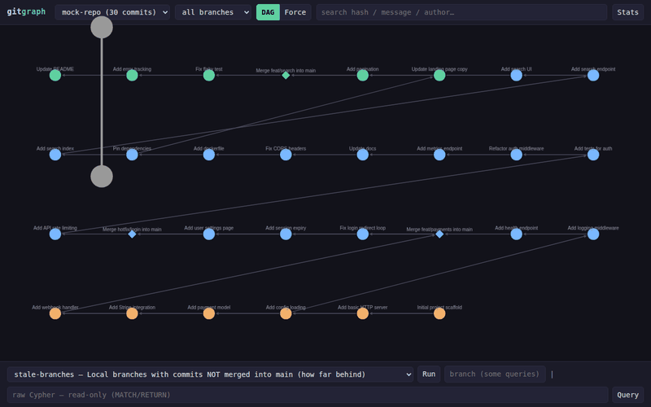

# gitgraph

Your git repositories as a **queryable graph**. Every commit, branch, tag, author
and file across all your repos lives in Neo4j — browse it visually, hover for
commit and push details, and ask questions no git visualizer can answer:

- *"Which branches are unmerged and how far behind main?"*
- *"Which files does this branch touch that main has never seen?"*
- *"Every commit by author X across ALL my repos?"*
- *"Who commits at 3am?"*



## What you get

**Visual** — a DAG timeline with branch-colored commit lanes (hover a node for
commit + push details, hover an edge for that commit's message, click for the
full panel), plus a force-directed "big picture" view.

**Searchable** — hash prefix, message text, or author.

**Queryable** — named queries and a raw read-only Cypher box. This is the part
no other git tool has: the graph is a database, not a picture.

## Quick start

```bash
docker compose up -d          # Neo4j 5 (Community)
python3 -m venv .venv
.venv/bin/pip install -r requirements.txt
./bin/gitgraph import /path/to/repo --with-files
./bin/gitgraph import /another/repo            # multi-repo: share by hash
./bin/gitgraph serve                           # http://127.0.0.1:8000
```

The import is idempotent — re-run after new commits to sync. Branches and tags
are scoped per repo; commits are shared by hash, so the same commit in cloned
repos is one node.

## CLI

```
gitgraph import <path> [--with-files]   import a repo (idempotent)
gitgraph stats                          graph summary per repo
gitgraph query "<cypher>"               run raw Cypher
gitgraph query --named <name> [--repo X] [--branch Y]
gitgraph queries                        list named queries
gitgraph serve [--port 8000]            start the web UI
gitgraph wipe                           empty the graph
```

### Named queries

| query | answers |
|-------|---------|
| `stale-branches` | unmerged local branches, commits behind main |
| `divergent-files` | files a branch touches that main never has |
| `author-stats` | commits / additions / deletions per author per repo |
| `hot-files` | most-modified files across the graph |
| `merge-map` | every merge commit — the shape of your branching |
| `longest-history` | deepest ancestry chains per repo |
| `night-owls` | authors whose commits happen outside working hours |

## Data model

```
(:Repo)-[:CONTAINS]->(:Commit {hash, msg, author, authored_at, additions, deletions, files_changed, merged})
(:Commit)-[:PARENT]->(:Commit)          ← the DAG (merge commits get 2+)
(:Repo)-[:HAS_BRANCH]->(:Branch {name, remote})-[:POINTS_TO]->(:Commit)
(:Repo)-[:HAS_TAG]->(:Tag)-[:POINTS_TO]->(:Commit)
(:Commit)-[:AUTHORED_BY]->(:Author {name, email})
(:Commit)-[:MODIFIED]->(:File {path})   ← optional (--with-files)
```

## Stack

- **Neo4j 5 Community** (Docker, ports 7474/7687, auth via `.env`)
- **Python** — `neo4j` driver importer, FastAPI backend
- **Frontend** — single-page vanilla JS + vendored Cytoscape.js (no build step)

Credentials live in `.env` (gitignored); defaults `neo4j` / `gitgraph`.
